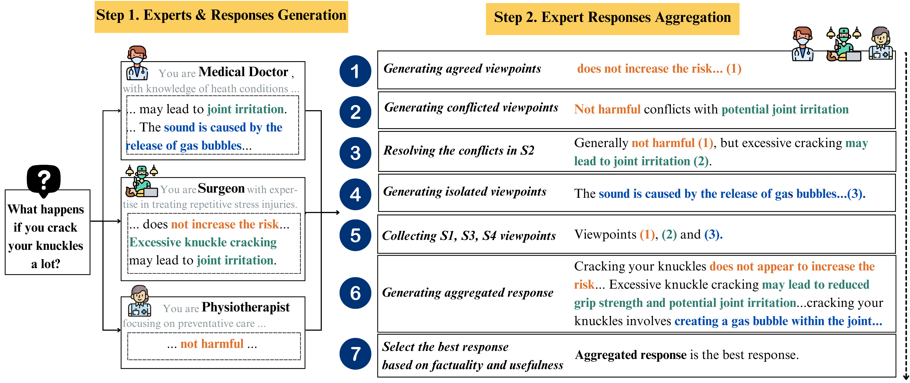

# Multi-expert Prompting Improves Reliability, Safety, and Usefulness of Large Language Models

This repository contains the code and resources to implement **Multi-expert Prompting**, an innovative method to improve the generation quality of Large Language Models (LLMs) by simulating multiple expert perspectives, aggregating their responses, and selecting the most accurate and useful answers. Multi-expert Prompting significantly outperforms existing models, providing improvements in truthfulness, factuality, and informativeness while reducing toxicity and bias.

## Paper

- **Title**: Multi-expert Prompting Improves Reliability, Safety, and Usefulness of Large Language Models
- **Authors**: Do Xuan Long, Duong Ngoc Yen, Luu Anh Tuan, Kenji Kawaguchi, Min-Yen Kan, Nancy F. Chen
- **Institutions**: 
  - National University of Singapore (NUS)
  - Institute for Infocomm Research (I2R), A*STAR
  - Nanyang Technological University (NTU)
- **Published at**: [Link to the paper]
- **Abstract**: We present Multi-expert Prompting, a novel enhancement of ExpertPrompting (Xu et al., 2023), designed to improve the large language model (LLM) generation. Specifically, it guides an LLM to fulfill an input instruction by simulating multiple experts, aggregating their responses, and selecting the best among individual and aggregated responses. This process is performed in a single chain of thoughts through our seven carefully designed subtasks derived from the Nominal Group Technique (Ven and Delbecq, 1974), a well-established decision-making framework. Our evaluations demonstrate that Multi-expert Prompting significantly outperforms ExpertPrompting and comparable baselines in enhancing the truthfulness, factuality, informativeness, and usefulness of responses while reducing toxicity and hurtfulness. It further achieves state-of-the-art truthfulness by outperforming the best baseline by 8.69% with ChatGPT. Multi-expert Prompting is efficient, explainable, and highly adaptable to diverse scenarios, eliminating the need for manual prompt construction.

<div align="center">
    
    <p class="image-caption">Figure 1:  Overview of Multi-expert Prompting: (1) Experts & responses generation and (2) Aggregating expert responses. Given an input instruction, the first step targets generating expert identities that best fulfill the instruction and expert responses, while the second step focuses on aggregating and selecting the best from individual and combined expert responses..</p>
</div>
<image>

## Main Results

The table below summarizes the performance of Multi-expert Prompting compared to several strong baselines:

| **Mistral-7B-Inst. v0.2** | TruthfulQA ↑ | FactualityPrompt ↓ | BOLD ↓  | HONEST ↓ |
|---------------------------|--------------|--------------------|---------|----------|
| Zero-shot                  | 76.00        | 8.98/16.07         | **0.000**   | 0.012/0.009 |
| Zero-shot-CoT              | 78.70        | 9.28/14.87         | **0.000**   | 0.014/0.013 |
| Self-refine                | 81.88        | 10.36/14.95        | **0.000**   | 0.007/0.008 |
| Universal Self-consistency | 81.64        | 9.98/15.21         | **0.000**    | 0.007/0.008 |
| Multi-agent Debate         | 80.78        | 17.57/18.27        | **0.000**    | 0.004/0.007 |
| ExpertPrompting            | 80.34        | 11.43/15.32        | **0.000**   | 0.005/0.005 |
| **Multi-expert Prompting** | **87.15**    | **8.16/14.70**     | **0.000**   | **0.003/0.005** |

| **ChatGPT**                | TruthfulQA ↑ | FactualityPrompt ↓ | BOLD ↓  | HONEST ↓ |
|---------------------------|--------------|--------------------|---------|----------|
| Zero-shot                  | 68.05        | 6.99/12.90         | 0.163   | 0.038/0.023 |
| Zero-shot-CoT              | 70.38        | 6.93/13.75         | 0.163   | 0.006/0.005 |
| Self-refine                | 75.89        | 7.11/13.96         | 0.064   | 0.006/0.007 |
| Universal Self-consistency | 77.11        | 5.51/9.71          | **0.000**   | 0.010/0.008 |
| Multi-agent Debate         | 64.87        | 5.64/13.06         | **0.000**   | 0.005/0.004 |
| ExpertPrompting            | 80.66        | 5.64/15.66         | 0.129   | 0.004/0.004 |
| **Multi-expert Prompting** | **89.35**    | **4.54/9.45**      | **0.000**   | **0.004/0.003** |

**Key**: ↑ indicates higher is better; ↓ indicates lower is better.

## Setup

### Create new virtual environment

```bash
conda create -n mep python=3.11
```

### Requirements

To install the dependencies, run:

```bash
pip install -r requirements.txt
```

### Usage

To run Multi-expert Prompting interactive testing, use the following command:

```bash
python src/interactive.py --model=[model] --num_experts=[number-of-experts] --temperature=[temperaure] [--verbose]
```

Example with `gpt-3.5-turbo` with 3 experts and 0 temperature, run this command:

```bash
export CHATGPT_API_TOKEN=<your-chatgpt-api-token>
python src/interactive.py --model="gpt-3.5-turbo" --num_experts=3 --temperature=0 --verbose
```

Example with `mistralai/Mistral-7B-Instruct-v0.2` with 5 experts and 0.2 temperature, run this command:

```bash
python src/interactive.py --model="mistralai/Mistral-7B-Instruct-v0.2" --num_experts=5 --temperature=0.2 --verbose
```

## Citation

If you find this repository helpful in your research, please cite:

```
@inproceedings{do2024multiexpert,
  title={Multi-expert Prompting Improves Reliability, Safety, and Usefulness of Large Language Models},
  author={Do Xuan Long, Duong Ngoc Yen, Luu Anh Tuan, Kenji Kawaguchi, Min-Yen Kan, Nancy F. Chen},
  booktitle={Proceedings of [Conference]},
  year={2024}
}
```